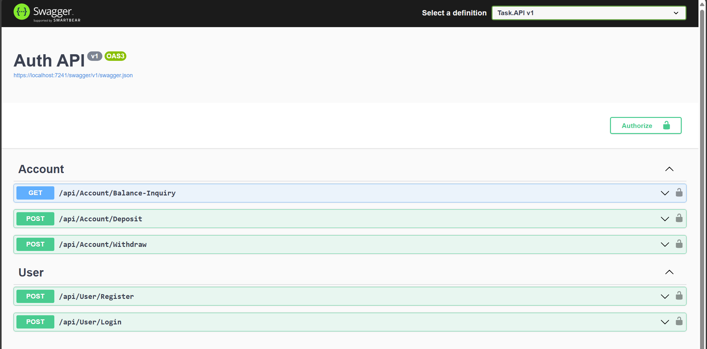
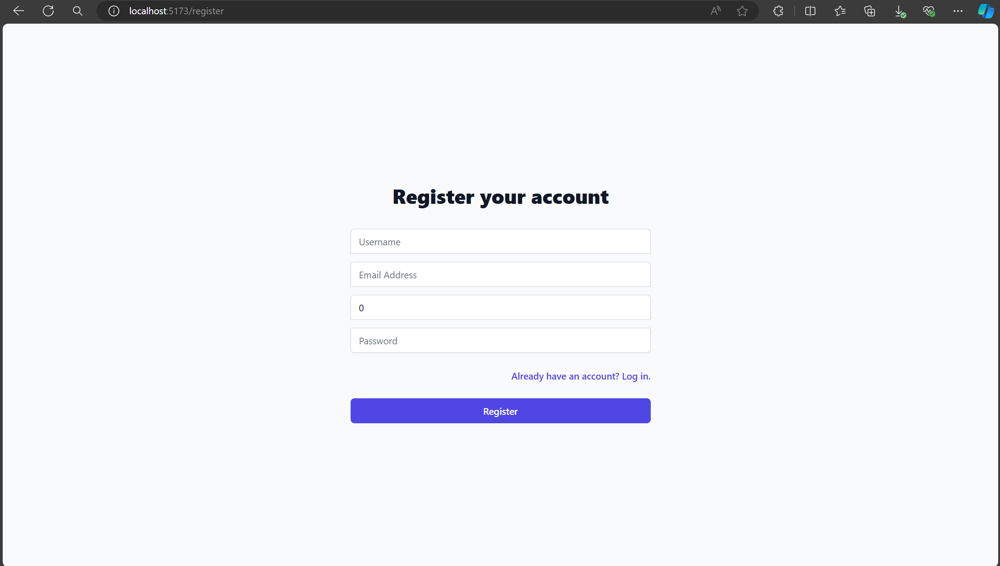
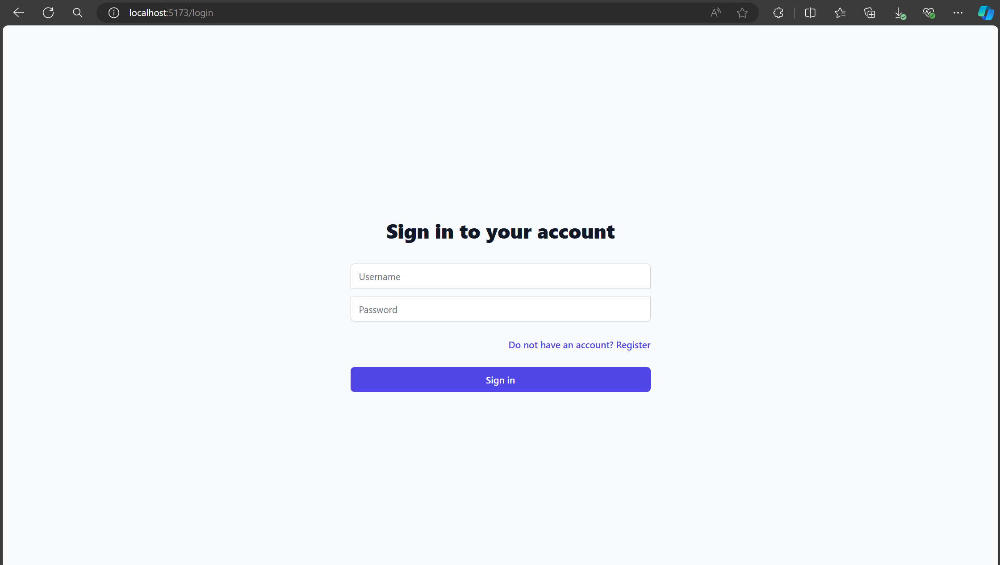
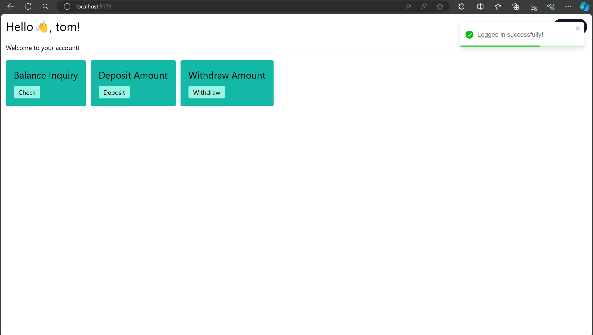
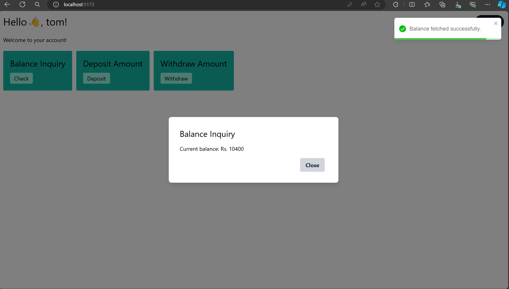
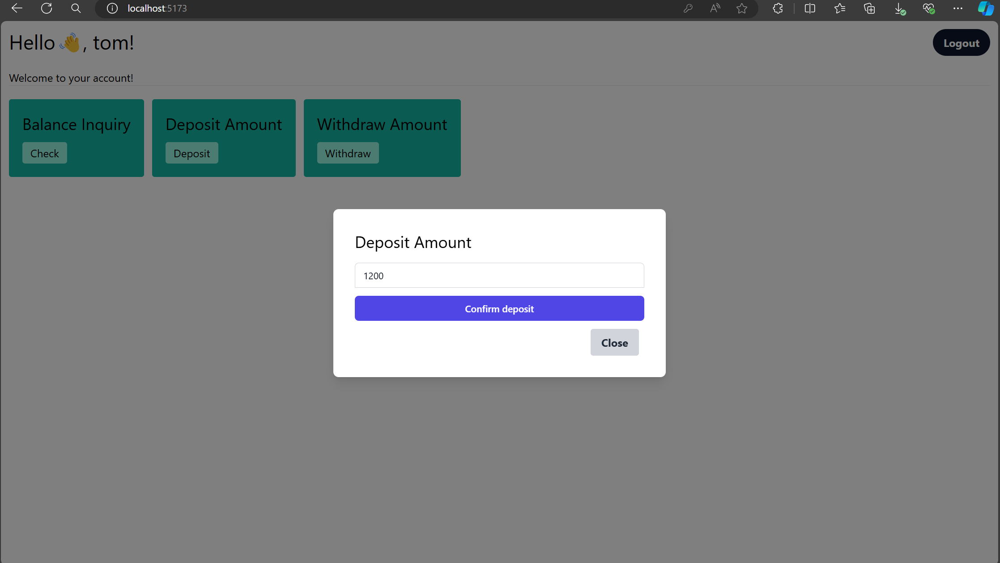
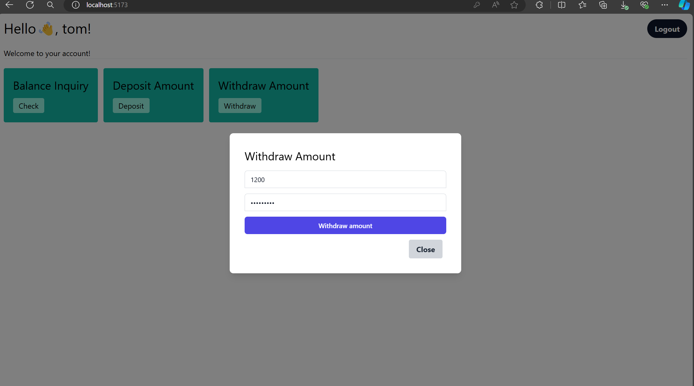

# ASP.NET Core Web API project with JWT Authentication

## Overview
This project is designed to simulate a bank account using database with JWT authentication. The main features  of the program include:
- Account creation functionality
- Deposit functionality
- Withdrawal functionality
- Show current balance functionality.

## Used technology

- ASP.NET Core Web API
- MS-SQL
- React & TailwindCSS (for frontend)

## Setup Instructions

### Prerequisites
Before you begin, ensure you have met the following requirements:
- Windows OS
- The system must have dotnet environment installed.
- [Dependencies] (e.g., node package manager (npm))

### Installation

1. **Clone the repository**
   ```bash
   git clone https://github.com/rrieshavv/dotnet-jwt-bank.git
   cd dotnet-jwt-bank/
   ```

2. **Restore the database (Database.bak) using the SQL Server Management Studio.**

3. **Update the connection string in appsettings.json.**
    ```
    "ConnectionStrings": {
        "Default": "Data Source=103.37.***.**;Initial Catalog=NewT;Persist Security Info=True;User ID=sa;Password=***;Encrypt=False;Trust Server Certificate=True"
    },
    ```

4. **Launch the backend server**
    ```bash
    cd Task/Task.API/
    dotnet run --launch-profile https
    ```
    **Note: The backend server must start at https://localhost:7241 to communicate with frontend** 

5. **Install the node modules in the frontend**
    ```bash
     cd frontend/
     npm i
     npm run dev
    ```

### Highlights

- **API Endpoints**
    

- **User Registration Component**

    

- **User Login Component**

    

- **Home Component**

    

- **Balance Inquiry Component**

    

- **Deposit Component**

    

- **Withdraw Component**

    